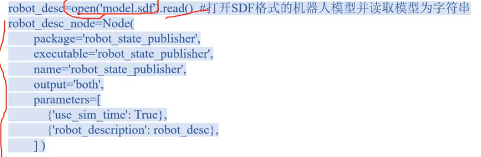

#创建py虚拟环境 在本项目src下
python3 -m venv face --system-site-packages
source face/bin/activate

#退出
deactivate

#安装阿里云
python3 -m pip install -i https://mirrors.aliyun.com/pypi/simple/          --force-reinstall --no-cache-dir colcon-common-extensions

pip install face_recognition -i https://mirrors.aliyun.com/pypi/simple

#gz sim
https://app.gazebosim.org/fuel/models

Resource Spawner
控制面板
teleop

#添加本地模型 改地址创建
code ~/.bashrc

export GZ_SIM_RESOURCE_PATH=~/linux/gz_models

source ~/.bashrc 

 ros-lyrical-ros-gz
 使用手动转换
 xacro /path/to/your/robot.urdf.xacro > /tmp/robot.urdf
 gz sdf -p /tmp/robot.urdf > /tmp/robot.sdf
 gz sim /tmp/robot.sdf

#sdf->urdf 从gazebo机器人模型显示到rviz
sudo apt install ros-lyrical-sdformat-urdf -y
